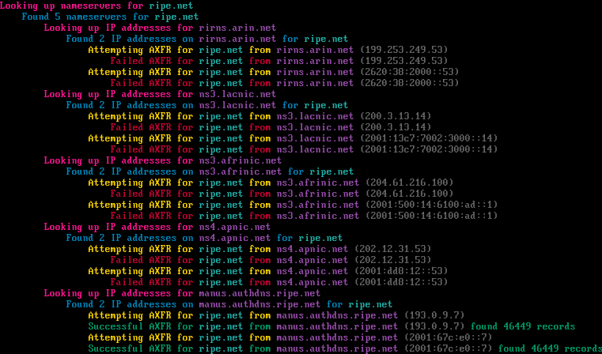
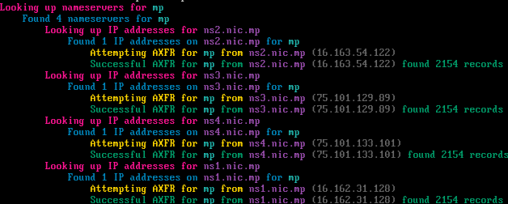

# Mass DNS AXFR (Zone Transfer)

## Information
MDAXFR allows you to perform a DNS [Zone Transfer](https://en.wikipedia.org/wiki/DNS_zone_transfer) against a target domain by resolving all of the domains nameservers to their respective A/AAAA records and making an AXFR attempt against each of the IP addresses.

You can also use this tool against the [Root Nameservers](https://en.wikipedia.org/wiki/Root_name_server) and [Top-level Domains](https://en.wikipedia.org/wiki/Top-level_domain) *(TLD)*, including those in the [Public Suffix List](https://en.wikipedia.org/wiki/Public_Suffix_List) *(PSL)* aswell.




## Expectations & Legalities
It is expected to set *realistic* expectations when using this tool. In contemporary network configurations, AXFR requests are typically restricted, reflecting best practices in DNS security. While many nameservers now disallow AXFR requests, there may still be occasional instances where configurations permit them. Always exercise due diligence and ensure ethical use.

## Usage
### POSIX Version

```shell
./mdaxfr <option>
```

###### Options
| Argument      | Description                                                                                 |
| ------------- | ------------------------------------------------------------------------------------------- |
| `-tld`,       | Perform AXFR on all TLDs                                                                    |
| `-psl`,       | Perform AXFR on all PSL TLDs                                                                |
| `<axfr_file>` | Perform AXFR on all domains found in `<axfr_file>` *(must be an AXFR output file from dig)* |
| `<domain>`    | Perform AXFR on `<domain>`                                                                  |

### Python Version
```shell
python mdaxfr.py <option>
```

###### Requirements
- [dnspython](https://pypi.org/project/dnspython/) *(`pip install dnspython`)*

###### Options
| Argument              | Description                                          |
| --------------------- | ---------------------------------------------------- |
| `-c`, `--concurrency` | Maximum concurrent tasks.                            |
| `-o`, `--output`      | Specify the output directory *(default is axfrout)*. |
| `-t`, `--timeout`     | DNS timeout *(default: 30)*                          |

## Statistics, laughs, & further thinking...
I only wrote this to shit on **[this bozo](https://github.com/flotwig/TLDR-2/)** who took a dead project & brought it back to life by making it even worse. Rather than making a pull request to give this bloke more credit in his "tenure" as a developer, I decided to just rewrite it all from scratch so people can fork off of *clean* code instead.

As of my last scan in 2023, I was only able to AXFR the zones for **8** out of **1,456** root TLDs, with a few of them being zones that were already retrieved by [acidvegas/czds](https://github.com/acidvegas/czds/), & **114** out of **7,977** TLDs in the [Public suffix list](https://publicsuffix.org/). The [addition scripts](./extras/) in this repository provide an additional **37** zone files.

For laughs, here is a one-liner mass zone axfr:
```bash
curl -s https://www.internic.net/domain/root.zone | awk '$4=="A" || $4=="AAAA" {print substr($1, 3) " " $5}' | sed 's/\.$//' | xargs -n2 sh -c 'dig AXFR "$0" "@$1"'
```
**Note:** Don't actually use this lol...

It is interesting to have seen this has worked on some "darknet" DNS servers...would maybe look into exploring collecting more zones for alterntive DNS routing. I am also intruiged at how much you can explore [ARPANET](https://en.wikipedia.org/wiki/ARPANET) with AXFRs...more ARPAgheddon coming soon...

___

###### Mirrors for this repository: [acid.vegas](https://git.acid.vegas/mdaxfr) • [SuperNETs](https://git.supernets.org/acidvegas/mdaxfr) • [GitHub](https://github.com/acidvegas/mdaxfr) • [GitLab](https://gitlab.com/acidvegas/mdaxfr) • [Codeberg](https://codeberg.org/acidvegas/mdaxfr)